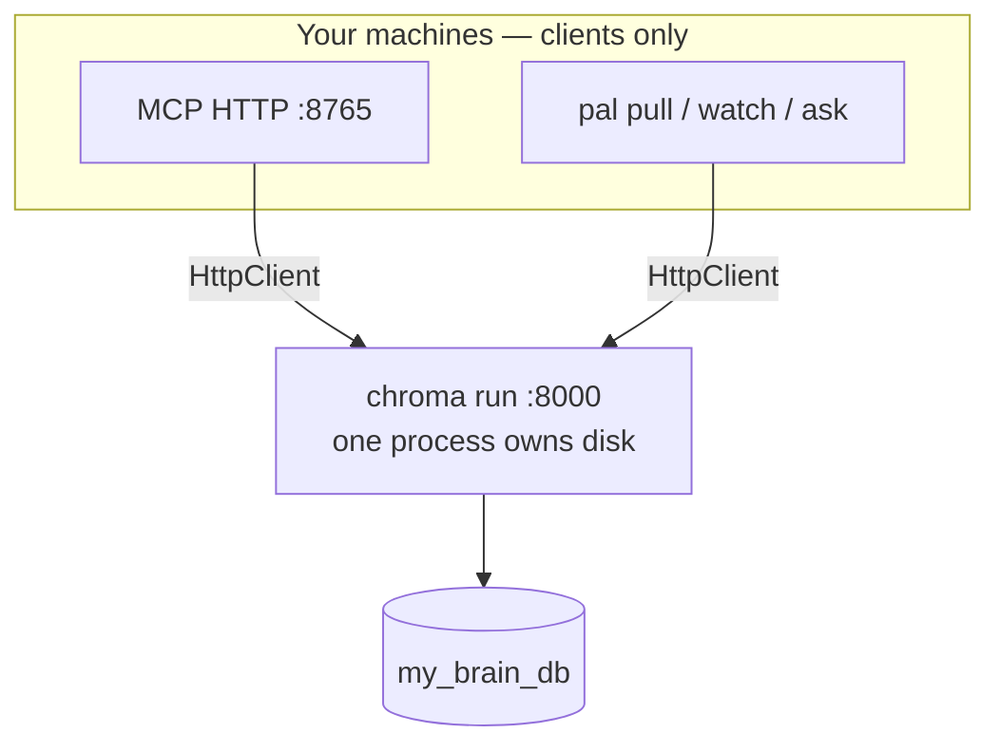

# llmLibrarian guide

A plain-language map of **why** this tool exists and **how** to use it without reading the whole codebase.

---

## The problem

Modern work leaves trails: repos, journals, tax PDFs, meeting notes, half-written plans. When you need an answer, you rarely lack *an* LLM — you lack **the right passage from your own files**.

Tools that only search filenames or exact text miss paraphrases. Tools that upload your whole drive trade away control. Tools that rely on chat “memory” blur what came from you versus what the model invented.

llmLibrarian is a **local index + retrieval layer**: you decide what’s in scope, refresh when files change, and get **chunks with paths and scores** so answers can cite real sources.

---

## Why vector search (in one paragraph)

Classic search matches strings. **Vector search** encodes meaning: “API redesign risks” can find a paragraph that never uses that phrase. llmLibrarian stores **chunks** (pieces of documents) with embeddings, then ranks what’s closest to your question. It also mixes in **keyword-style** signals where that helps (names, years, tax lines), so you get hybrid retrieval — not magic, but much closer to how you actually remember things.

---

## Core ideas

| Term | Meaning |
|------|---------|
| **Silo** | One indexed folder (or file), registered under a slug |
| **Chunk** | A passage returned to you or an agent, with source path and metadata |
| **MCP** | How Cursor (and others) call retrieval/ingest tools over HTTP |
| **`pal ask`** | Full local pipeline: retrieve + Ollama answer in the terminal |
| **Stateless Q&A** | No built-in chat persona; each ask uses the current index + query |

---

## Cursor and MCP

**What MCP does here:** exposes your index as **tools**, not as “the model already knows your life.”

Typical agent flow:

1. `list_silos` (optionally `check_staleness=True`)
2. `query_personal_knowledge` or `multi_query_knowledge` with a scoped silo when possible
3. `health` if results are empty but the silo should have data
4. `add_silo` / `trigger_reindex` / `repair_silo` for ingest and recovery (`confirm=True` on writes)

The **host model** (Claude, etc.) reads chunk text and writes the answer. llmLibrarian does **not** run Ollama inside MCP — that keeps MCP fast and lets you choose the brain in the IDE.

**What crosses the network:** only what the tool returns (top chunks), plus normal chat context — not your entire disk. Provider training/memory policies are up to **Cursor/your API settings**, not this repo.

---

## Terminal and Ollama (`pal ask`)

When you want **everything local**:

```bash
pal ask --in my-silo "question here"
```

That runs retrieval (same engine as MCP) then calls **Ollama** once with a strict “answer only from context” prompt. Use `-q` for answer-only output in scripts.

Ollama’s **desktop chat app** does not use this index unless you wire a bridge yourself. `pal ask` *is* the local Q&A path.

---

## Process layout (server mode)

When `LLMLIBRARIAN_CHROMA_HOST` is set (recommended with MCP + watchers):



Only **one** process should own the on-disk HNSW index. Extra `mcp_server.py` PIDs are usually orphans or stdio sessions — not intentional multi-server design. See [CHROMA_AND_STACK.md](./CHROMA_AND_STACK.md).

---

## Asking good questions

**Telescope** — explore a silo or corpus:

- “What kinds of documents are in here?”
- “What themes repeat across projects?” (`--unified`)

**Pinpoint** — one fact, one place:

- “Where is `foo` defined?”
- “2023 AGI from tax docs?”
- Always prefer `--in <silo>` when you know the folder.

If the answer should cite **one** paragraph, write like a librarian. If you want a **survey**, expect broader chunks and more hedging.

---

## Configuration

Preferred env file (not in git):

```bash
install -d -m 700 ~/.config/llmLibrarian
chmod 600 ~/.config/llmLibrarian/.llmlibrarian.env
```

Or point systemd/MCP at repo `.env.mcp` via `LLMLI_MCP_ENV_FILE` / `LLMLIBRARIAN_ENV_FILE`.

Common variables:

| Variable | Purpose |
|----------|---------|
| `LLMLIBRARIAN_DB` | Index directory (default `./my_brain_db`) |
| `LLMLIBRARIAN_CHROMA_HOST` / `PORT` | Server mode → `pal chroma start` |
| `LLMLIBRARIAN_MODEL` | Ollama model for `pal ask` |
| `LLMLIBRARIAN_RERANK=1` | Optional reranker on CLI ask path |

---

## Troubleshooting

- **Low confidence / thin answers** — narrow silo, check `pal inspect`, reindex if files changed.
- **`Error finding id`** — `llmli repair <silo>`.
- **MCP + `pal pull` conflicts** — enable Chroma server mode; don’t use embedded writers while HTTP MCP holds the DB without server mode.
- **Cloud-sync paths** — blocked by default; use `--allow-cloud` only if files are truly local copies.

---

## What this is not

- Not a hosted multi-tenant product
- Not semantic “pick which MCP tool to call” (fixed tool surface; host chooses tools)
- Not a replacement for web search or general knowledge
- Not multi-database routing across Pinecone/Qdrant/etc. — one local Chroma collection, silo metadata

For implementers: [TECH.md](./TECH.md), [AGENTS.md](../AGENTS.md).
